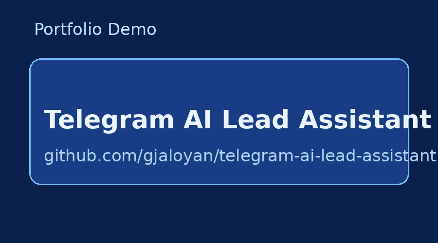

# Telegram AI Lead Assistant (Portfolio MVP)

Business-focused automation demo: capture inbound Telegram leads, classify intent, store structured data, and notify a sales/manager channel.

## What it does

- Receives inbound lead messages (webhook endpoint)
- Classifies message intent (`lead`, `faq`, `support`)
- Extracts simple lead fields (`name`, `phone`, `intent`)
- Saves records to CSV (`data/leads.csv`)
- Sends alert to Telegram manager chat (optional)
- Exposes `/health` and `/stats` endpoints

## Tech

- Python 3.11
- FastAPI + Uvicorn
- Lightweight rule-based classifier (easy to replace with LLM/API)
- Docker + docker-compose

## Quick start

```bash
cp .env.example .env
# fill TELEGRAM_BOT_TOKEN and TELEGRAM_MANAGER_CHAT_ID if you want alerts

docker compose up --build
```

App runs at: `http://localhost:8080`

## Demo request

```bash
curl -X POST http://localhost:8080/webhook/telegram \
  -H 'Content-Type: application/json' \
  -d '{
    "message": {
      "chat": {"id": 12345},
      "text": "Hi, I need pricing for automation. My phone is +37499111222"
    }
  }'
```

## Endpoints

- `GET /health`
- `GET /stats`
- `POST /webhook/telegram`

## Project structure

```
.
├── src/
│   ├── main.py
│   ├── classifier.py
│   ├── storage.py
│   └── notifier.py
├── data/
├── .env.example
├── requirements.txt
├── Dockerfile
└── docker-compose.yml
```


## Architecture

See: [`docs/architecture.md`](docs/architecture.md)

## Demo Preview



## Portfolio Assets

- Upwork snippet: [`docs/upwork-portfolio-snippet.md`](docs/upwork-portfolio-snippet.md)
- Demo script: [`docs/demo-script.md`](docs/demo-script.md)

## Notes for clients

This is a portfolio MVP to demonstrate business automation flow.
Production setup can include:

- CRM integration (HubSpot/Pipedrive/Sheets)
- multilingual prompts
- advanced lead scoring
- retries + observability + admin dashboard

## License

MIT
